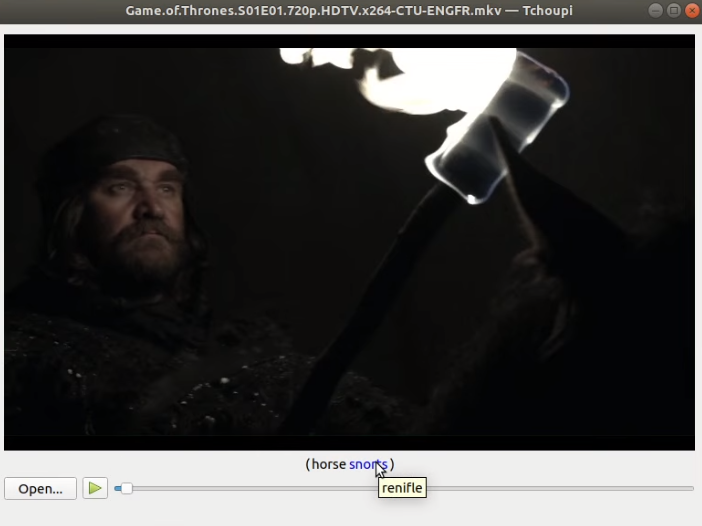

# Tchoupi
Tchoupi is a basic player with interactive subtitles. It gives you an easy way to translate a word without opening any translator.

## Prerequisites
If you want to build the source code you need to install Qt :

```
minimum Qt 5.12.0
minimum QtCreator 4.8.1
```

## Installation

```bash
git clone https://github.com/narcine/Tchoupi.git
```
## Run the player
Go inside the binaries folder

```bash
./Tchoupi.sh
```
## How to use it ?

- Download on the internet the srt file related to your video or create one
- Put it in the same folder as the video
- Click on the open button to choose a video from your computer.
- Press the play button.
- Fly over a label, the text color will turn into blue and a tooltip containing the translation will display.
The player will be also paused. If the text color does not turn into blue it means no translation has been provided.
- Use the mouse, the play button or the space bar to play/pause.
 


## How does it works ?

### Srt file

Srt files are used to get the subtitles. You can find srt files on the internet or create one by yourself.
The Tchoupi application uses only that format for the subtitles.

Here is the srt syntax :
```
[subId]
[start_position] --> [end_position]
[subtitle_1]
[subtitle_2]

[subId]
[start_position] --> [end_position]
[subtitle_1]
    ---
[subtitle_N]

Ex:
  66
  00:10:33,744 --> 00:10:35,945
  ( Sighs )
  ( Laughing )
  
---

subId : The subtitle ID
start_position : The starting time
end_position : The ending time
```
### Dic file

Dic files are used to translate words from one langague to another. It can be considered as a translation dictionary where only translated words are present.

The default dic files are located at the translation folder's root directory. If you open one of them you will see a lot of words with a default translation.

It is also possible to create your own dic file. You can do that to override the default translation or given a specific translation for a subtitle.

Here is the dic syntax :

```
[words] :
[subId], [translation_1]
[subId], [translation_2]

[words] :
[subId], [translation_1]
       ---
[subId], [translation_N]

Ex :
  snorts :
  default, renifle
  1, se renifle

---

words : Words or group of words encountered in the subtitles          
subId : default :
            The translation will apply on the entire video
or
        subtitle ID (1,2,3,etc.. See srt rules) :
            The translation will apply on the desired subtitle. 
            It overrides the default one.
```

### Mandatory location & syntax

#### Location

The environment variables :
- **TRANSLATION_PATH** : it defines the location of the default dic files (created for all the videos)
- **VIDEO_TRANSLATION_PATH** : it defines the location of the specific dic files (created for one video)

should be defined. Otherwise the default dic files will be searched in the same directory as the application. And the specific dic files will be searched in the same directory as the video.

```
Ex :
  TRANSLATION_PATH=../translation
  VIDEO_TRANSLATION_PATH=../translation/video
```

**!!! Srt files should always be put next to the video.**

#### Syntax 

All the files must have the same name and end with :

```
-[LANG1][LANG2].* 

```

**excepted** default dic files which are named :

```
aw_[LANG1][LANG2].dic

```

[LANG1][LANG2] means : translate from *LANG1* to *LANG2*


- **LANG1** : The language code (ex : ENG,FR,ESP...) for the first language
- **LANG2** : The language code (ex : ENG,FR,ESP...) for the second language

```
Ex :
  video-name-ENGFR.dic
  video-name-ENGFR.mkv
  video-name-ENGFR.srt
  aw_ENGFR.dic
```
